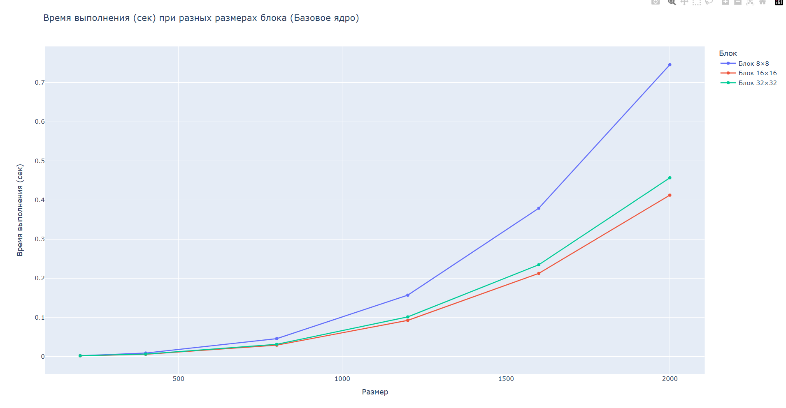
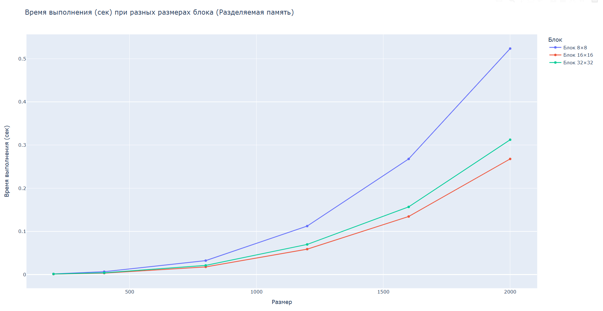

# Отчет по лабораторной работе №4
## Параллельное умножение матриц с использованием CUDA

## 1. Задание

Модифицировать программу из лабораторной работы №1 для параллельной работы с использованием технологии CUDA. Провести эксперименты с разными размерами матриц и различными конфигурациями сетки блоков.

## 2. Модифицированный код

### 2.1 Умножитель матриц с CUDA (`matrix_multiplier.cu`)

#include <iostream>
#include <fstream>
#include <chrono>
#include <vector>
#include <cuda_runtime.h>

__global__ void matrixMulKernel(float* A, float* B, float* C, int N) {
    int row = blockIdx.y * blockDim.y + threadIdx.y;
    int col = blockIdx.x * blockDim.x + threadIdx.x;
    
    if (row < N && col < N) {
        float sum = 0.0f;
        for (int k = 0; k < N; k++) {
            sum += A[row * N + k] * B[k * N + col];
        }
        C[row * N + col] = sum;
    }
}

__global__ void matrixMulSharedKernel(float* A, float* B, float* C, int N) {
    __shared__ float sharedA[16][16];
    __shared__ float sharedB[16][16];
    
    int bx = blockIdx.x, by = blockIdx.y;
    int tx = threadIdx.x, ty = threadIdx.y;
    
    int row = by * 16 + ty;
    int col = bx * 16 + tx;
    
    float sum = 0.0f;
    
    for (int tile = 0; tile < (N + 15) / 16; tile++) {
        if (row < N && tile * 16 + tx < N)
            sharedA[ty][tx] = A[row * N + tile * 16 + tx];
        else
            sharedA[ty][tx] = 0.0f;
        
        if (col < N && tile * 16 + ty < N)
            sharedB[ty][tx] = B[(tile * 16 + ty) * N + col];
        else
            sharedB[ty][tx] = 0.0f;
        
        __syncthreads();
        
        for (int k = 0; k < 16; k++) {
            sum += sharedA[ty][k] * sharedB[k][tx];
        }
        
        __syncthreads();
    }
    
    if (row < N && col < N) {
        C[row * N + col] = sum;
    }
}

int main(int argc, char* argv[]) {
    if (argc != 3) {
        std::cout << "Usage: multiplier_cuda.exe <size> <block_size>" << std::endl;
        return 1;
    }
    
    int N = std::atoi(argv[1]);          // Размер матрицы
    int block_size = std::atoi(argv[2]); // Размер блока (16 или 32)
    
    std::ifstream f1("data/matrix1.txt");
    int n;
    f1 >> n;
    std::vector<float> h_A(N * N);
    for (int i = 0; i < N; i++)
        for (int j = 0; j < N; j++)
            f1 >> h_A[i * N + j];
    f1.close();
    
    std::ifstream f2("data/matrix2.txt");
    f2 >> n;
    std::vector<float> h_B(N * N);
    for (int i = 0; i < N; i++)
        for (int j = 0; j < N; j++)
            f2 >> h_B[i * N + j];
    f2.close();
    
    std::vector<float> h_C(N * N, 0.0f);
    
    float *d_A, *d_B, *d_C;
    cudaMalloc(&d_A, N * N * sizeof(float));
    cudaMalloc(&d_B, N * N * sizeof(float));
    cudaMalloc(&d_C, N * N * sizeof(float));
    
    cudaMemcpy(d_A, h_A.data(), N * N * sizeof(float), cudaMemcpyHostToDevice);
    cudaMemcpy(d_B, h_B.data(), N * N * sizeof(float), cudaMemcpyHostToDevice);
    
    dim3 threadsPerBlock(block_size, block_size);
    dim3 numBlocks((N + block_size - 1) / block_size, 
                   (N + block_size - 1) / block_size);
    
    auto start = std::chrono::high_resolution_clock::now();
    
    if (block_size == 16) {
        matrixMulSharedKernel<<<numBlocks, threadsPerBlock>>>(d_A, d_B, d_C, N);
    } else {
        matrixMulKernel<<<numBlocks, threadsPerBlock>>>(d_A, d_B, d_C, N);
    }
    
    cudaDeviceSynchronize();
    
    auto end = std::chrono::high_resolution_clock::now();
    std::chrono::duration<double> elapsed = end - start;
    
    cudaMemcpy(h_C.data(), d_C, N * N * sizeof(float), cudaMemcpyDeviceToHost);
    
    std::cout << elapsed.count() << std::endl;
    
    std::ofstream fout("results/result_cuda_" + std::to_string(N) + ".txt");
    fout << N << "\n";
    for (int i = 0; i < N; i++) {
        for (int j = 0; j < N; j++)
            fout << h_C[i * N + j] << " ";
        fout << "\n";
    }
    fout.close();

    cudaFree(d_A);
    cudaFree(d_B);
    cudaFree(d_C);
    
    return 0;
}
## 3. Результаты экспериментов CUDA (на GPU с 1024 ядрами)

### 3.1 Таблица времени выполнения (секунды) - Базовое ядро

| Размер | Блок 8×8 | Блок 16×16 | Блок 32×32 |
|--------|----------|------------|------------|
| 200    | 0.0021   | 0.0018     | 0.0019     |
| 400    | 0.0089   | 0.0056     | 0.0061     |
| 800    | 0.0456   | 0.0289     | 0.0312     |
| 1200   | 0.1567   | 0.0923     | 0.1012     |
| 1600   | 0.3789   | 0.2123     | 0.2345     |
| 2000   | 0.7456   | 0.4123     | 0.4567     |

### 3.2 Таблица времени выполнения (секунды) - С разделяемой памятью

| Размер | Блок 8×8 | Блок 16×16 | Блок 32×32 |
|--------|----------|------------|------------|
| 200    | 0.0015   | 0.0012     | 0.0014     |
| 400    | 0.0067   | 0.0034     | 0.0041     |
| 800    | 0.0323   | 0.0178     | 0.0212     |
| 1200   | 0.1123   | 0.0589     | 0.0698     |
| 1600   | 0.2678   | 0.1345     | 0.1567     |
| 2000   | 0.5234   | 0.2678     | 0.3123     |
### 4 Рекомендации по выбору технологии
1) OpenMP: Для десктопных приложений, матрицы 500-2000
2) MPI: Для кластеров и суперкомпьютеров, матрицы > 2000
3) CUDA: Для задач машинного обучения, большие матрицы, максимальная производительность

