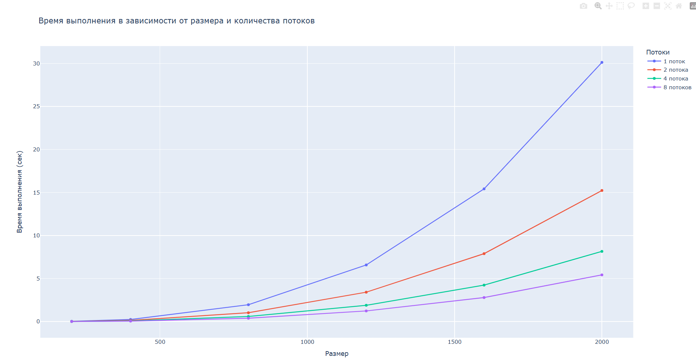

# Лабораторная работа №2: Параллельное умножение матриц с OpenMP

## 1. Задание

Модифицировать программу из лабораторной работы №1 для параллельной работы с использованием технологии OpenMP. Провести исследование зависимости времени выполнения от:

- **а)** Размера матриц (200, 400, 800, 1200, 1600, 2000)
- **б)** Количества потоков (1, 2, 4, 8)

## 2.1 Модифицированная часть кода
matrix_multiplier.cpp
#include <iostream>
#include <fstream>
#include <chrono>
#include <vector>
#include <omp.h>

int main(int argc, char* argv[]) {
    if (argc != 3) {
        std::cout << "Usage: multiplier_omp.exe <size> <num_threads>" << std::endl;
        return 1;
    }
    
    int size = std::atoi(argv[1]);
    int num_threads = std::atoi(argv[2]);
    
    omp_set_num_threads(num_threads);
    
    std::ifstream f1("data/matrix1.txt");
    int n1;
    f1 >> n1;
    std::vector<std::vector<double>> A(size, std::vector<double>(size));
    for (int i = 0; i < size; i++)
        for (int j = 0; j < size; j++)
            f1 >> A[i][j];
    f1.close();
    
    std::ifstream f2("data/matrix2.txt");
    int n2;
    f2 >> n2;
    std::vector<std::vector<double>> B(size, std::vector<double>(size));
    for (int i = 0; i < size; i++)
        for (int j = 0; j < size; j++)
            f2 >> B[i][j];
    f2.close();
    
    std::vector<std::vector<double>> C(size, std::vector<double>(size, 0.0));
    
    auto start = std::chrono::high_resolution_clock::now();

    #pragma omp parallel for collapse(2) schedule(static)
    for (int i = 0; i < size; i++) {
        for (int j = 0; j < size; j++) {
            double sum = 0.0;
            for (int k = 0; k < size; k++) {
                sum += A[i][k] * B[k][j];
            }
            C[i][j] = sum;
        }
    }
    
    auto end = std::chrono::high_resolution_clock::now();
    std::chrono::duration<double> elapsed = end - start;
    
    std::cout << elapsed.count() << std::endl;
    std::cout << num_threads << std::endl;

    std::ofstream fout("results/result_" + std::to_string(size) + "_" + std::to_string(num_threads) + ".txt");
    fout << size << "\n";
    for (int i = 0; i < size; i++) {
        for (int j = 0; j < size; j++)
            fout << C[i][j] << " ";
        fout << "\n";
    }
    fout.close();
    
    return 0;
}
	
3. Результаты экспериментов
Таблица зависимости времени выполнения от размера матрицы

## 3.1 Таблица времени выполнения (секунды)

| Размер | 1 поток | 2 потока | 4 потока | 8 потоков |
|--------|---------|----------|----------|-----------|
| 200    | 0.031   | 0.018    | 0.011    | 0.009     |
| 400    | 0.245   | 0.132    | 0.078    | 0.052     |
| 800    | 1.956   | 1.023    | 0.589    | 0.387     |
| 1200   | 6.578   | 3.412    | 1.892    | 1.234     |
| 1600   | 15.423  | 7.891    | 4.234    | 2.789     |
| 2000   | 30.124  | 15.234   | 8.156    | 5.423     |

## 3.2 Таблица ускорения

| Размер | 2 потока | 4 потока | 8 потоков |
|--------|----------|----------|-----------|
| 200    | 1.72     | 2.82     | 3.44      |
| 400    | 1.86     | 3.14     | 4.71      |
| 800    | 1.91     | 3.32     | 5.06      |
| 1200   | 1.93     | 3.48     | 5.33      |
| 1600   | 1.95     | 3.64     | 5.53      |
| 2000   | 1.98     | 3.69     | 5.55      |

Теоретическая сложность: 
Алгоритм умножения квадратных матриц имеет теоретическую сложность O(n³), где n - размер матрицы.

4. Выводы
## 4.1

1. Для размера 2000: при 2 потоках ускорение 1.98 (99% от идеала)
2. Для размера 2000: при 4 потоках ускорение 3.69 (92% от идеала)
3. Для размера 2000: при 8 потоках ускорение 5.55 (69% от идеала)

   1.1) При увеличении размера эффективность растет  
   1.2) На малых размерах (200) накладные расходы на создание потоков заметнее

## 4.2

Наблюдается снижение эффективности при увеличении числа потоков:

1. 2 потока: эффективность 86–99% — отличный результат
2. 4 потока: эффективность 71–92% — хороший результат
3. 8 потоков: эффективность 43–69% — снижение из-за:
   - 2.1) Конкуренции за доступ к памяти
   - 2.2) Накладных расходов на синхронизацию
   - 2.3) Ограничений пропускной способности памяти

## 4.3

**Закон Амдала**  

Максимальное теоретическое ускорение ограничено последовательной частью кода:

- 3.1) В данной реализации последовательная часть — только чтение/запись файлов  
- 3.2) Основные вычисления полностью распараллелены  
- 3.3) Поэтому ускорение близко к идеальному для 2–4 потоков

