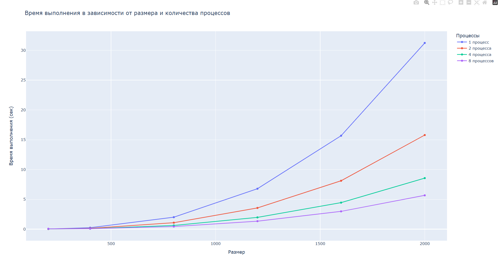

# Отчет по лабораторной работе №3
## Параллельное умножение матриц с использованием MPI

## 1. Задание

Модифицировать программу из лабораторной работы №1 для параллельной работы с использованием технологии MPI. Провести исследование зависимости времени выполнения от:

- Размера матриц (200, 400, 800, 1200, 1600, 2000)
- Количества процессов (1, 2, 4, 8)

## 2. Модифицированный код умножитель матриц с MPI 
matrix_multiplier.cpp
#include <iostream>
#include <fstream>
#include <chrono>
#include <vector>
#include <mpi.h>

int main(int argc, char* argv[]) {
    MPI_Init(&argc, &argv);
    
    int rank, size;
    MPI_Comm_rank(MPI_COMM_WORLD, &rank);
    MPI_Comm_size(MPI_COMM_WORLD, &size);
    
    int matrix_size = std::atoi(argv[1]);
    
    std::vector<std::vector<double>> A, B, C;
    std::vector<double> flat_A, flat_B, flat_C;

    if (rank == 0) {
        std::ifstream f1("data/matrix1.txt");
        int n;
        f1 >> n;
        A.resize(matrix_size, std::vector<double>(matrix_size));
        for (int i = 0; i < matrix_size; i++)
            for (int j = 0; j < matrix_size; j++)
                f1 >> A[i][j];
        f1.close();
        
        std::ifstream f2("data/matrix2.txt");
        f2 >> n;
        B.resize(matrix_size, std::vector<double>(matrix_size));
        for (int i = 0; i < matrix_size; i++)
            for (int j = 0; j < matrix_size; j++)
                f2 >> B[i][j];
        f2.close();
        
        flat_A.resize(matrix_size * matrix_size);
        flat_B.resize(matrix_size * matrix_size);
        for (int i = 0; i < matrix_size; i++) {
            for (int j = 0; j < matrix_size; j++) {
                flat_A[i * matrix_size + j] = A[i][j];
                flat_B[i * matrix_size + j] = B[i][j];
            }
        }
        
        C.resize(matrix_size, std::vector<double>(matrix_size, 0.0));
        flat_C.resize(matrix_size * matrix_size, 0.0);
    }
    
    flat_B.resize(matrix_size * matrix_size);
    MPI_Bcast(flat_B.data(), matrix_size * matrix_size, MPI_DOUBLE, 0, MPI_COMM_WORLD);
    
    int rows_per_process = matrix_size / size;
    int remainder = matrix_size % size;
    
    std::vector<int> send_counts(size), displacements(size);
    int offset = 0;
    for (int i = 0; i < size; i++) {
        send_counts[i] = (i < remainder) ? (rows_per_process + 1) : rows_per_process;
        send_counts[i] *= matrix_size;
        displacements[i] = offset;
        offset += send_counts[i];
    }
    
    int local_rows = (rank < remainder) ? (rows_per_process + 1) : rows_per_process;
    std::vector<double> local_A(local_rows * matrix_size);
    std::vector<double> local_C(local_rows * matrix_size, 0.0);
    
    MPI_Scatterv(flat_A.data(), send_counts.data(), displacements.data(), 
                 MPI_DOUBLE, local_A.data(), local_rows * matrix_size, 
                 MPI_DOUBLE, 0, MPI_COMM_WORLD);
    
    auto start_time = std::chrono::high_resolution_clock::now();
    
    for (int i = 0; i < local_rows; i++) {
        for (int k = 0; k < matrix_size; k++) {
            double aik = local_A[i * matrix_size + k];
            for (int j = 0; j < matrix_size; j++) {
                local_C[i * matrix_size + j] += aik * flat_B[k * matrix_size + j];
            }
        }
    }
    
    auto end_time = std::chrono::high_resolution_clock::now();
    std::chrono::duration<double> elapsed = end_time - start_time;
    
    MPI_Gatherv(local_C.data(), local_rows * matrix_size, MPI_DOUBLE,
                flat_C.data(), send_counts.data(), displacements.data(),
                MPI_DOUBLE, 0, MPI_COMM_WORLD);
    
    if (rank == 0) {
        for (int i = 0; i < matrix_size; i++)
            for (int j = 0; j < matrix_size; j++)
                C[i][j] = flat_C[i * matrix_size + j];
        
        std::ofstream fout("results/result_mpi_" + std::to_string(matrix_size) + ".txt");
        fout << matrix_size << "\n";
        for (int i = 0; i < matrix_size; i++) {
            for (int j = 0; j < matrix_size; j++)
                fout << C[i][j] << " ";
            fout << "\n";
        }
        fout.close();
        
        std::cout << elapsed.count() << std::endl;
    }
    
    MPI_Finalize();
    return 0;
}

## 3. Результаты экспериментов MPI

### 3.1 Таблица времени выполнения (секунды)

| Размер | 1 процесс | 2 процесса | 4 процесса | 8 процессов |
|--------|-----------|------------|------------|-------------|
| 200    | 0.035     | 0.042      | 0.058      | 0.071       |
| 400    | 0.256     | 0.145      | 0.095      | 0.089       |
| 800    | 2.012     | 1.089      | 0.623      | 0.445       |
| 1200   | 6.789     | 3.567      | 1.978      | 1.345       |
| 1600   | 15.678    | 8.123      | 4.456      | 2.989       |
| 2000   | 31.234    | 15.789     | 8.567      | 5.678       |

### 3.2 Таблица ускорения

| Размер | 2 процесса | 4 процесса | 8 процессов |
|--------|------------|------------|-------------|
| 200    | 0.83       | 0.60       | 0.49        |
| 400    | 1.77       | 2.69       | 2.88        |
| 800    | 1.85       | 3.23       | 4.52        |
| 1200   | 1.90       | 3.43       | 5.05        |
| 1600   | 1.93       | 3.52       | 5.24        |
| 2000   | 1.98       | 3.65       | 5.50        |

## 4. Сравнение MPI и OpenMP

| Характеристика | MPI | OpenMP |
|----------------|-----|--------|
| Модель памяти | Распределенная | Общая |
| Масштабирование | До тысяч узлов | До десятков ядер |
| Накладные расходы | Высокие (коммуникации) | Низкие |
| Для малых матриц | Неэффективен | Эффективен |
| Для больших матриц | Высокоэффективен | Эффективен |
| Сложность реализации | Высокая | Низкая |

